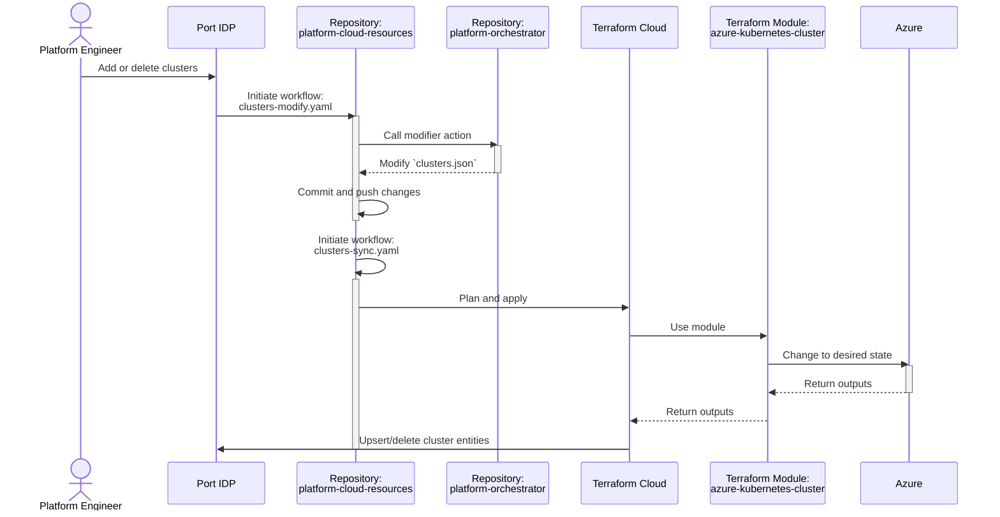
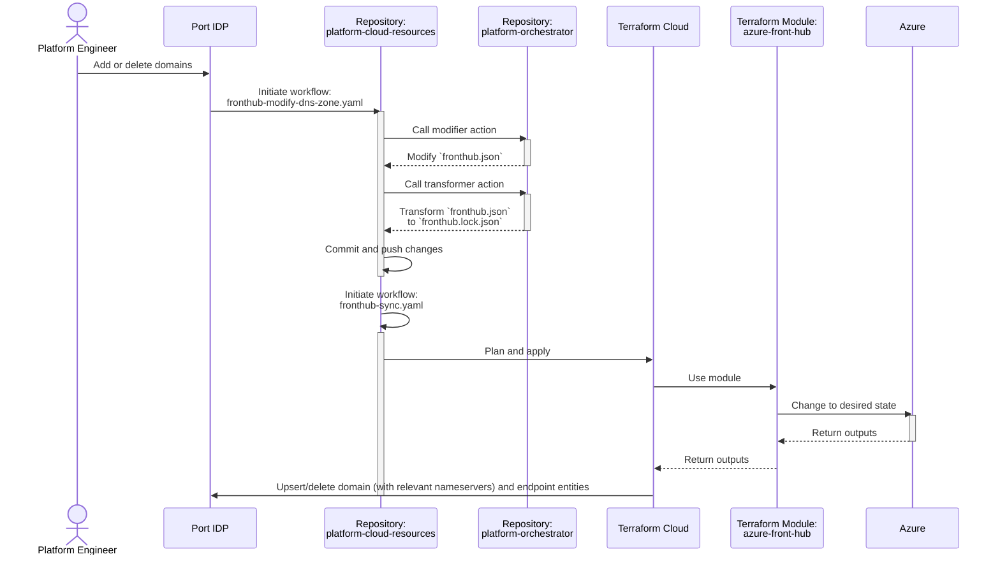
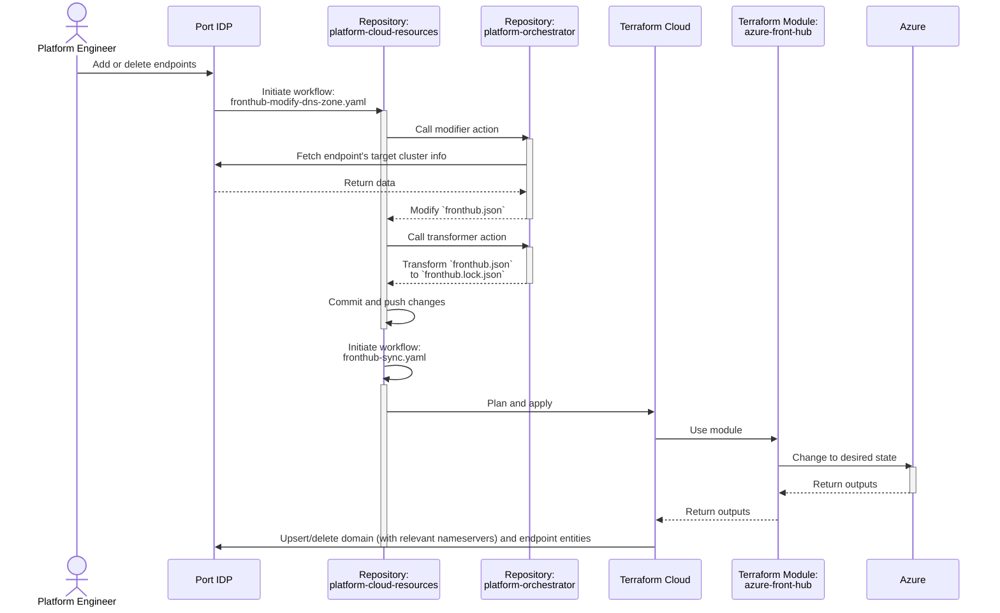

# Readme for Platform Cloud Resources

## Overview

This repository is dedicated to managing cloud resources, specifically for Azure, using Terraform. It facilitates cloud-related self-service actions within the Internal Developer Platform (IDP) of [Port](https://getport.io/).

### Capabilities
- [x] Management of Kubernetes clusters.
- [x] Management of domains and DNS zones.
- [x] Management of dedicated endpoints for clusters.

### Integration
- [Port](https://app.getport.io/)
- [Azure](https://azure.microsoft.com/en-us)

### Tools and Modules
- [Platform Orchestrator (GitHub Actions)](https://github.com/PashmakGuru/gha-platform-orchestrator)
- [Kubernetes Cluster (Terraform Module)](https://github.com/PashmakGuru/terraform-azure-kubernetes-cluster)
- [Fronthub (Terraform Module)](https://github.com/pashmakGuru/terraform-azure-fronthub)

## Architecture
### Sequence of Cluster Management

### Sequence of DNS Zone Management

### Sequence of Endpoint Management

## Components

- **Clusters**: The [clusters](clusters/) directory focuses on managing Kubernetes Clusters on Azure (AKS) using the terraform-azure-kubernetes-cluster module.
- **Fronthub**: The [fronthub](fronthub/) directory deals with Azure DNS Zones and endpoint management for Azure Front Door, assigning subdomains or paths to specific clusters.

## Workflows

| Name                                | Description                                                                                                                                      |
|-------------------------------------|--------------------------------------------------------------------------------------------------------------------------------------------------|
| [clusters-modify.yaml](.github/workflows/clusters-modify.yaml) | Modifies [clusters.json](clusters/clusters.json) as per Port's instructions, followed by committing and pushing changes.                       |
| [clusters-sync.yaml](.github/workflows/clusters-sync.yaml)     | Executes terraform to provision or synchronize clusters.                                                                                         |
| [fronthub-modify-dns-zone.yaml](.github/workflows/fronthub-modify-dns-zone.yaml) | Alters [fronthub.json](fronthub/fronthub.json) for domain management based on Port's guidance, updates [fronthub.lock.json](fronthub/fronthub.lock.json), and commits and pushes changes. |
| [fronthub-modify-endpoint.yaml](.github/workflows/fronthub-modify-endpoint.yaml) | Adjusts [fronthub.json](fronthub/fronthub.json) for endpoint management as per Port's instructions, followed by committing and pushing the final configuration. |
| [fronthub-manual-transform.yaml](.github/workflows/fronthub-manual-transform.yaml) | Manually triggered to transform [fronthub.json](fronthub/fronthub.json) to its final configuration, with subsequent commit and push operations. |
| [fronthub-sync.yaml](.github/workflows/fronthub-sync.yaml)     | Runs terraform to provision or update Azure DNS Zones and Front Door endpoints.
